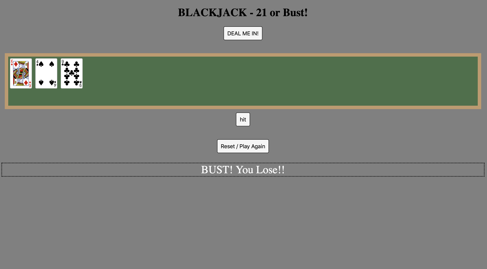

<BLACKJACK - 21 OR BUST!> 

-A PROJECT BY RYAN GEORGE-

This is my first game, a simple take on the perennial classic parlor game: BLACKJACK.

Getting Started: 

https://ryanpgeorge.github.io/project1-blackjack/

The rules are simple. When you click the button "DEAL ME IN!" you are dealt two cards from a shuffled deck. Unlike traditional blackjack, there is no retreat. You have two choices - hit or bust! Player must continue to draw cards from the shuffled deck by clicking the hit button, and with luck, will eventually draw a score matching the lucky number - 21! Players unlucky enough to exceed the lucky number will be met with a tragic fate - A BUST!

Technologies Used:Javascript, HTML, CSS

NEXT STEPS: (ICEBOX)
In the future, I plan to implement:
* 2-player functionality for head to head gameplay
* Dealer gameplay functionality that will allow a player to stay, and compare their hand against the dealer's generated hand
* Wager functionality - place your bet to make things really interesting! Your winnings will persist over multiple hands within the game. 
